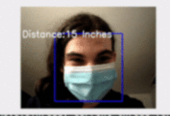

## naive distance measurements with opencv


- [*xpost on my blog*](https://transscendsurvival.org/)
- [*readme on github.io*](https://jesssullivan.github.io//misc-roi-distance-notes/)


<br/>

Knowing both the Field of View (FoV) of a camera's lens and the dimensions of the object we'd like to measure (Region of Interest, ROI) seems like more than enough to get a distance.

Note, [opencv has an extensive suite of actual calibration tools and utilities here.](https://docs.opencv.org/4.5.0/d9/db7/tutorial_py_table_of_contents_calib3d.html)

...But without calibration or much forethought, could rough measurements of known objects even be usable?  Some notes from a math challenged individual:


```
# clone:
git clone https://github.com/Jesssullivan/misc-roi-distance-notes && cd misc-roi-distance-notes
```


Most webcams don't really provide a Field of View much greater than ~50 degrees- this is the value of a MacBook Pro's webcam for instance.  Here's the plan to get a Focal Length value from Field of View:


<a href="https://www.codecogs.com/eqnedit.php?latex=Focal&space;Length&space;=&space;(\frac{ImageDimension}{2})&space;tan(\frac{FieldOfView}{2})" target="_blank" rel="noopener"></a>


So, thinking along the lines of similar triangles:

-  Camera angle <a href="https://www.codecogs.com/eqnedit.php?latex=\measuredangle\frac{FoV}{2}" target="_blank"></a> forms the angle between the *hypotenuse* side (one edge of the FoV angle) and the *adjacent* side
- Dimension <a href="https://www.codecogs.com/eqnedit.php?latex=\frac{ImageDimension}{2}" target="_blank"></a> is the *opposite* side of the triangle we are using to measure with.  
- ^ This makes up the first of two ["similar triangles"](https://byjus.com/maths/similar-triangle-construct/)
- Then, we start measuring: First, calculate the opposite ROI Dimension using the arbitrary Focal Length value we calculated from the first triangle- then, plug in the Actual ROI Dimensions.  
- Now the adjacent side of this ROI triangle should hopefully be length, in the the units of ROI's Actual Dimension.


source a fresh venv to fiddle from:
```
# venv:
python3 -m venv distance_venv
source distance_venv/bin/activate

# depends are imutils & opencv-contrib-python:
pip3 install -r requirements.txt
```


The opencv people provide a bunch of [prebuilt Haar cascade models](https://github.com/opencv/opencv/tree/master/data/haarcascades), so let's just snag one of them to experiment. Here's one to detect human faces, we've all got one of those:


```
mkdir haar
wget https://raw.githubusercontent.com/opencv/opencv/master/data/haarcascades/haarcascade_frontalface_alt2.xml  -O ./haar/haarcascade_frontalface_alt2.xml
```

Of course, an actual thing with fixed dimensions would be better, like a stop sign!

Let's try to calculate the *distance* as the *difference* between an actual dimension of the object with a detected dimension- here's the plan:


<a href="https://www.codecogs.com/eqnedit.php?latex=Distance&space;=&space;ActualDimension&space;*&space;\frac{FocalLength}{ROIDimension}" target="_blank" rel="noopener"></a>


#### *YMMV, but YOLO:*

```
# `python3 measure.py`
import math
from cv2 import cv2

DFOV_DEGREES = 50  # such as average laptop webcam horizontal field of view
KNOWN_ROI_MM = 240  # say, height of a human head  

# image source:
cap = cv2.VideoCapture(0)

# detector:
cascade = cv2.CascadeClassifier('./haar/haarcascade_frontalface_alt2.xml')

while True:

    # Capture & resize a single image:
    _, image = cap.read()
    image = cv2.resize(image, (0, 0), fx=.7, fy=0.7, interpolation=cv2.INTER_NEAREST)

    # Convert to greyscale while processing:
    gray_conv = cv2.cvtColor(image, cv2.COLOR_BGR2GRAY)
    gray = cv2.GaussianBlur(gray_conv, (7, 7), 0)

    # get image dimensions:
    gray_width = gray.shape[1]
    gray_height = gray.shape[0]

    focal_value = (gray_height / 2) / math.tan(math.radians(DFOV_DEGREES / 2))

    # run detector:
    result = cascade.detectMultiScale(gray)

    for x, y, h, w in result:

		dist = KNOWN_ROI_MM * focal_value / h
        dist_in = dist / 25.4

        # update display:
        cv2.rectangle(image, (x, y), (x + w, y + h), (255, 0, 0), 2)
        cv2.putText(image, 'Distance:' + str(round(dist_in)) + ' Inches',
                    (5, 100), cv2.FONT_HERSHEY_SIMPLEX, 1, (255, 255, 255), 2)
        cv2.imshow('face detection', image)

        if cv2.waitKey(1) == ord('q'):
            break

```


- - - 


*run demo with:*

```
python3 measure.py
```


<br/>


| *With only Field of View and a ROI of known dimensions, the accuracy of this "similar triangles" solution thus far has only been limited by image resolution and the quality of the detector- pretty cool!* |  |
|--|--|


<br/>


-Jess

